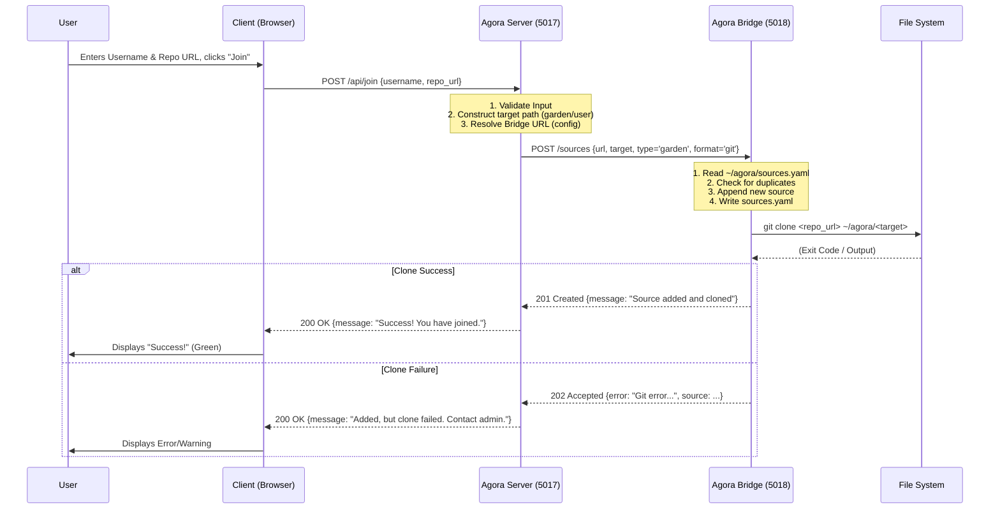

# Agora Architecture & Protocols

This document describes the architectural patterns and protocols used in the Agora, specifically focusing on the interaction between components (Server, Bridge) and external systems (Fediverse).

## 1. The Signup Protocol (Client -> Server -> Bridge)

The "Join" flow allows users to self-onboard by adding their Git repositories to the Agora.

### Components
*   **Client:** The JavaScript frontend (`settings.ts`, `overlay.html`).
*   **Agora Server:** The main Flask application (`agora.py`), serving as the public gateway.
*   **Agora Bridge:** An internal microservice (`api/agora.py`) running on a private port (default: 5018). It has privileged access to the filesystem and configuration.

### Sequence Diagram



## 2. The Federation Protocol (Content Broadcasting)

The Agora acts as an ActivityPub instance (`anagora.org`). It periodically broadcasts new content to its followers.

### Components
*   **Worker:** A background process (not shown) that updates the SQLite index from the filesystem.
*   **Federation Loop:** A background thread in `Agora Server` (`federate_latest_loop`).
*   **SQLite:** The database storing the graph (`subnodes`) and federation state (`federated_subnodes`, `followers`).

### Sequence Diagram

```mermaid
sequenceDiagram
    participant Loop as Federation Loop (Thread)
    participant DB as SQLite
    participant AP as ActivityPub Followers

    Note over Loop: Runs every 5 minutes

    Loop->>DB: Query "Latest" subnodes (api.latest)
    DB-->>Loop: [Subnode A, Subnode B...]
    
    loop For each Subnode
        Loop->>DB: Check is_subnode_federated(uri)
        
        opt Not Federated
            Note over Loop: 1. Construct 'Create' Activity<br/>2. Render Markdown to HTML<br/>3. Load RSA Keys
            
            Loop->>DB: Get Followers of Author (or @agora)
            
            loop For each Follower
                Loop->>AP: Resolve Inbox URL (WebFinger/Actor fetch)
                Loop->>AP: POST /inbox (Signed 'Create' Activity)
            end
            
            Loop->>DB: add_federated_subnode(uri)
        end
    end
```

## 3. Bridge Interface Specification

The **Agora Bridge** provides a RESTful interface for privileged operations.

**Base URL:** `http://localhost:5018` (Internal)

| Endpoint | Method | Payload | Description |
| :--- | :--- | :--- | :--- |
| `/` | `GET` | - | **Status Page.** Returns HTML listing configured sources and database stats. |
| `/sources` | `POST` | `url`: Git URL<br>`target`: Path slug<br>`type`: 'garden'\|'stoa'<br>`format`: 'git' (default) | **Add Source.** updates `sources.yaml` and triggers a synchronous `git clone`. |

---
*Generated by Gemini for Agora Docs, 2025-12-13.*
